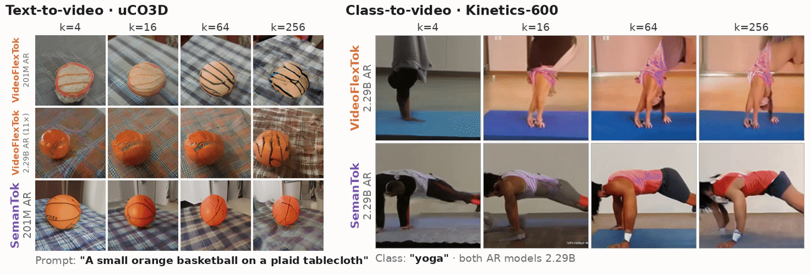
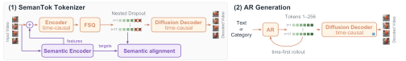
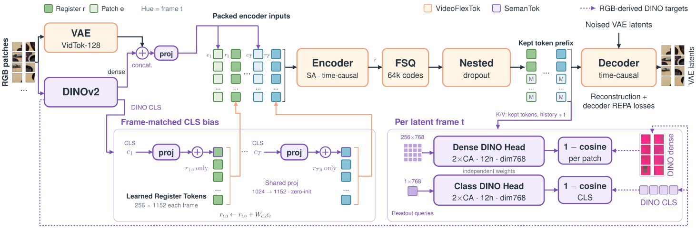

# SemanTok: Predictable Semantic Tokens for Efficient Autoregressive Video Generation

**[Project page](https://semantoken.github.io/)** · Paper (coming soon) · **[Checkpoints](https://huggingface.co/StabilityLabs/SemanTok)** (Hugging Face)

Mikhail Dereviannykh<sup>1,2</sup>, Vikram Voleti<sup>1</sup>, Simon Donné<sup>1</sup>,
Mallikarjun Byrasandra Ramalinga Reddy<sup>1</sup>, Shimon Vainer<sup>1</sup>, Mark Boss<sup>1</sup>

<sup>1</sup>[Stability AI](https://stability.ai) &nbsp; <sup>2</sup>[Karlsruhe Institute of Technology](https://www.kit.edu)

> **Status: internal draft.** Not yet reviewed for release. Do not make this repository public
> until the release review is done.

<p align="center"></p>

<sub>**Left:** at *k*=4, the 201M SemanTok AR model already keeps the ball's shape and appearance
through the orbit. VideoFlexTok's ball is misaligned at the same size, and still unstable up to
*k*=64 with an 11× larger AR model. **Right:** SemanTok keeps a complex body motion stable from
*k*=16; larger *k* refines it. VideoFlexTok changes the scene between *k*=4 and *k*=16. Matched
pair from 24 samples.</sub>

> [!IMPORTANT]
> **TL;DR.** Flexible video tokenizers (e.g., VideoFlexTok) let an autoregressive (AR) model stop
> after any number of tokens, which condition a diffusion decoder, so the first tokens should
> already capture what the clip shows. **SemanTok supervises this explicitly: every nested token
> prefix is trained to carry the clip's semantics.** The resulting prefixes are cheaper to predict
> and lead to better generation fidelity and higher semantic alignment: **a 201M SemanTok AR model
> matches or beats a VideoFlexTok AR model 3.4× its size.**

This repository has the **inference and evaluation** code: tokenizer reconstruction, class-to-video
(Kinetics-600) and text-to-video (uCO3D) generation, and the paper's evaluation protocols. It does
not include training code.

## How it works

<p align="center"></p>

The tokenizer encodes each latent frame into 256 ordered tokens, and any prefix of *k* tokens per
frame decodes to a video. The AR model predicts tokens coarse to fine, up to the budget *k* chosen
at inference.

<p align="center"></p>

*Orange*: the VideoFlexTok path. A frozen VidTok VAE maps the clip to latents; a time-causal
encoder reads patches and *K*=256 learnable register tokens per frame; FSQ quantizes the register
outputs; nested dropout keeps a token prefix that conditions a time-causal rectified-flow decoder.
*Purple*: SemanTok's semantic supervision. DINOv2 patch features are concatenated with each VAE
patch, the frame's DINO class token is added to its first register token, and Dense and Class DINO
heads reconstruct the DINO features from the kept prefix during training. SemanTok keeps
VideoFlexTok's FSQ codebook (64k codes), sequence length, nested dropout and decoder, so both
tokenizers are compared under the same AR models.
## Installation

```bash
git clone https://github.com/Stability-AI/SemanTokPublic && cd SemanTokPublic
pip install -e .          # Python >= 3.10, CUDA GPU
```

The tokenizer modules come from the upstream [VideoFlexTok](https://github.com/apple/ml-videoflextok)
inference package, installed unmodified at a pinned commit.

## Checkpoints

The checkpoints are on the Hugging Face Hub at
[StabilityLabs/SemanTok](https://huggingface.co/StabilityLabs/SemanTok), in bf16. Every script takes
`--ckpt-root` as either `hf://StabilityLabs/SemanTok` (downloads only the models it needs) or a local
directory with the same layout:

```
<ckpt-root>/
  tokenizers/{k600,uco3d}-{videoflextok,semantok}/        config.json, model.safetensors
  ar/{k600,uco3d}-{videoflextok,semantok}-d{10,12,16,20,24,30,36}/
```

```bash
CKPT=hf://StabilityLabs/SemanTok
# or download everything once (~26 GB):
huggingface-cli download StabilityLabs/SemanTok --local-dir ckpts && CKPT=ckpts
```

The d30 and d36 AR models are not on the Hub yet.

| tokenizer | data | training |
|---|---|---|
| `k600-videoflextok`, `k600-semantok` | Kinetics-600 | 200k steps (131B tokens) |
| `uco3d-videoflextok`, `uco3d-semantok` | uCO3D | 100k steps (66B tokens) |

AR depth `d` sets the size: d10 49M, d12 85M, d16 201M, d20 393M, d24 679M, d30 1.33B, d36 2.29B.
Kinetics-600 models are class-conditioned (597 classes); uCO3D models are conditioned on umT5 caption
embeddings (loaded from the `Wan-AI/Wan2.1-T2V-1.3B-Diffusers` text encoder, no video model involved).

## Usage

```bash
# Reconstruct a clip from its first k tokens per frame
python scripts/reconstruct.py --ckpt-root $CKPT --tokenizer k600-semantok --video clip.mp4 --ks 1 4 16 64 256

# Class-to-video (Kinetics-600)
python scripts/generate.py --ckpt-root $CKPT --ar k600-semantok-d16 --class-name "yoga" --ks 4 16 64 256

# Text-to-video (uCO3D)
python scripts/generate.py --ckpt-root $CKPT --ar uco3d-semantok-d16 \
    --prompt "A small orange basketball on a plaid tablecloth" --ks 4 16 64
```

From Python:

```python
from semantok import Tokenizer, load_ar
from semantok.data.video import load_kinetics_clip

tok = Tokenizer(f"{CKPT}/tokenizers/k600-semantok")
clip = load_kinetics_clip("clip.mp4")[None]          # [1, 3, 17, 128, 128] in [-1, 1]
tokens = tok.encode(clip)                            # [1, 5, 256] FSQ ids, coarse to fine
video = tok.decode(tokens, k=16)                     # decode from the first 16 tokens per frame
```

## Evaluation

The scripts reproduce the paper's protocols: the same clip pools (shipped in
`semantok/data/splits`), sample counts, seeds, batching, guidance and metric preprocessing.

```bash
scripts/download_eval_models.sh      # I3D (FVD), ViCLIP, UMT-L; ViCLIP and UMT are gated on HF, run `huggingface-cli login` first

# AR generation (Fig. 4): gFVD, gFID, ViCLIP, ClipV (+ class accuracy on Kinetics-600)
python scripts/eval_generation.py --ckpt-root $CKPT --ar k600-semantok-d16 --k600-root $K600/val --out results/
python scripts/eval_generation.py --ckpt-root $CKPT --ar uco3d-semantok-d16 --uco3d-root $UCO3D --out results/

# Tokenizer reconstruction (Table 2): rFVD, ViCLIP, ClipV, class accuracy, PSNR, SSIM
python scripts/eval_reconstruction.py --ckpt-root $CKPT --tokenizer k600-semantok --k600-root $K600/val --out results/
```

**Data.** Kinetics-600 validation videos at `<k600-root>/<label>/<youtube_id>_<start>_<end>.mp4`.
uCO3D: the official download (`rgb_videos` modality); video paths and captions are read
from its `metadata.sqlite`. The repository ships only clip-ID lists, no dataset annotations.

**Protocol.**
- Metrics compare against the VidTok VAE reconstruction of real clips, not raw frames.
- Kinetics-600: a 2048-clip reference pool. Generation uses 4096 samples at *k*=1, 3072 at *k*=4 and
  2048 otherwise, with AR guidance 3.0 at *k* ≤ 4, 2.0 for 8–32 and 1.0 for ≥ 64. Class accuracy is
  UMT-L top-1. The ViCLIP prompt is the class name.
- uCO3D: 2560 samples each against in-distribution and held-out-category pools of 1024 clips, AR
  guidance 3.0. gFVD and gFID are pooled at the official validation ratio of 1014:152; ViCLIP and ClipV
  use the same weights.
- Decoder: 50 flow steps, guidance 3.0. Seed 0.
- FID and FVD depend on sample size, so compare numbers only at the same pool sizes.

Reference values at 201M (d16), *k*=16, from the paper:

| | K600 gFVD ↓ | K600 class acc. ↑ | uCO3D gFVD ↓ | uCO3D ClipV ↑ |
|---|---|---|---|---|
| VideoFlexTok | 272.9 | 0.422 | 218.6 | 0.715 |
| SemanTok | **217.2** | **0.639** | **209.5** | **0.738** |

AR sampling is stochastic, so a rerun matches these up to sampling noise, not bit for bit.

**SemanTok encoder input.** SemanTok's encoder reads DINOv2 features of the input clip. By default
they are computed as in training: from the same 128 px clip the VAE sees, averaged over the frames of
each latent frame. `Tokenizer.encode(..., dino_clips=...)` accepts a different source, e.g. a higher
resolution crop of the same frames.

## Repository layout

```
semantok/
  tokenizer.py   Tokenizer: RGB clip <-> [5, 256] token ids, decode from any prefix k
  ar.py          AR model (inference only): KV cache, classifier-free guidance
  dino.py        DINOv2-L encoder input and class tokens (SemanTok)
  text.py        umT5 caption embeddings (uCO3D)
  data/          clip loaders, Kinetics-600 classes, evaluation pools
  eval/          metrics, pools, and the paper's evaluation protocols
scripts/         reconstruct, generate, eval_generation, eval_reconstruction, download_eval_models
```

## Acknowledgements

Built on [VideoFlexTok](https://github.com/apple/ml-videoflextok) (tokenizer architecture and
inference modules), [VidTok](https://github.com/microsoft/VidTok),
[DINOv2](https://github.com/facebookresearch/dinov2), umT5 (via Wan 2.1), and for evaluation
[StyleGAN-V](https://github.com/universome/stylegan-v)'s FVD detector,
[ViCLIP](https://github.com/OpenGVLab/InternVideo) and [UMT](https://github.com/OpenGVLab/unmasked_teacher)
(via [VBench](https://github.com/Vchitect/VBench)).

## Citation

```bibtex
@misc{dereviannykh2026semantok,
  title  = {SemanTok: Predictable Semantic Tokens for Efficient Autoregressive Video Generation},
  author = {Dereviannykh, Mikhail and Voleti, Vikram and Donn{\'e}, Simon and
            Reddy, Mallikarjun Byrasandra Ramalinga and Vainer, Shimon and Boss, Mark},
  year   = {2026}
}
```
